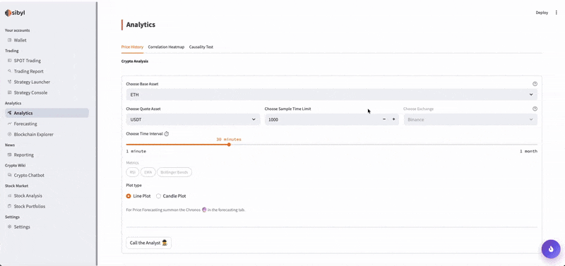
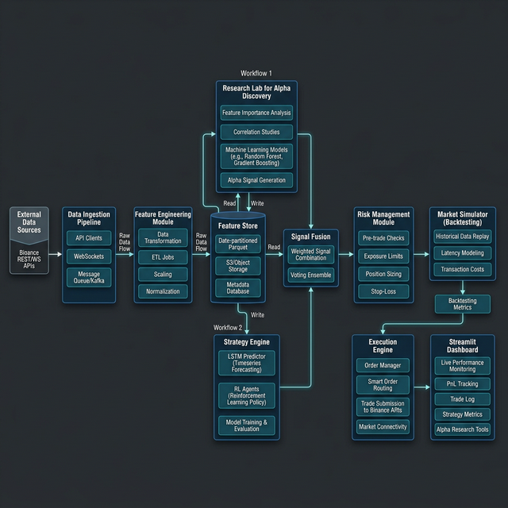
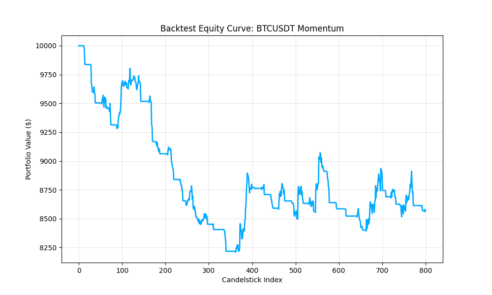
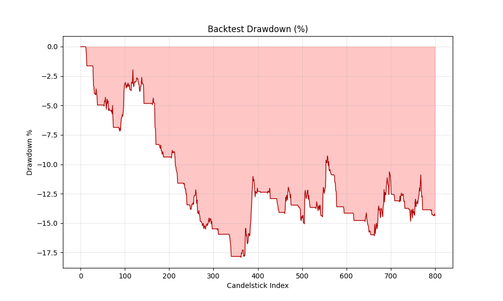
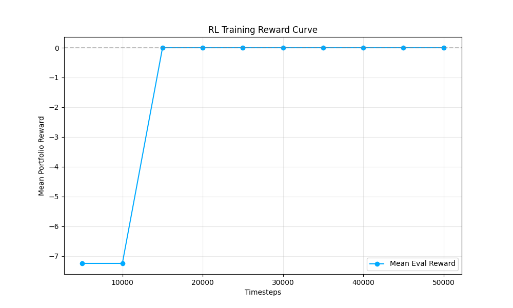
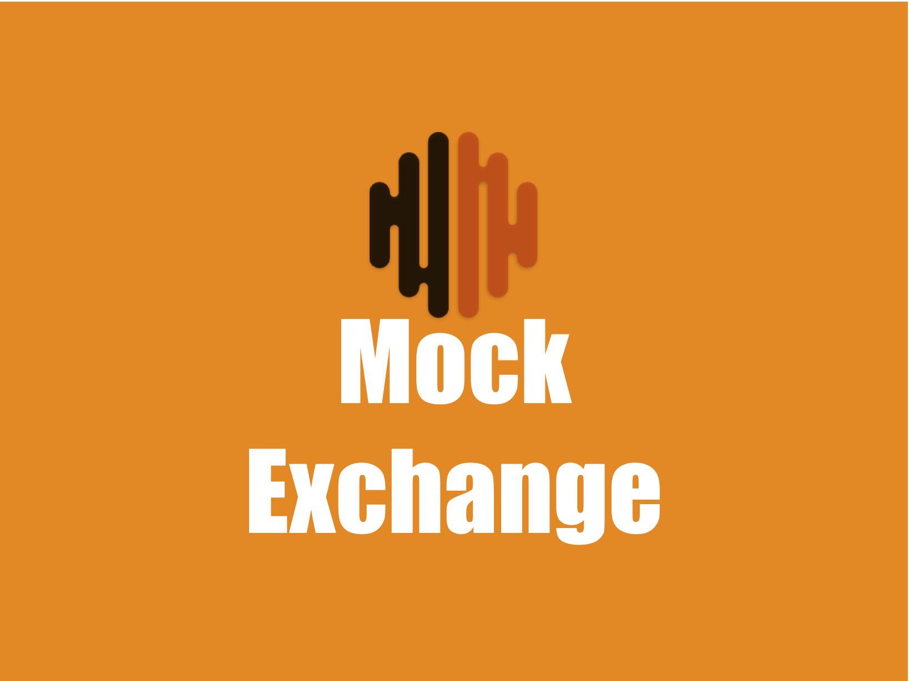

# AI Quantitative Trading Research Platform

[](https://opensource.org/licenses/MIT)
[](https://www.python.org/downloads/)
[]()
[]()

A modular, high-performance platform for quantitative trading research, alpha discovery, and machine learning trading experiments. This repository provides an end-to-end environment for developing, backtesting, and simulating AI-driven trading strategies with institutional-grade rigor.

## 📄 Research Paper

A detailed technical report describing the system architecture, research methodology, and experimental results is available below. This document provides a formal academic and engineering context for the platform.

👉 **[Quantitative Trading Research Paper](docs/quant_research_paper.md)**

## 📺 Project Showcase

This video demonstrates the end-to-end workflow of the platform:

1. **Market Data Ingestion**: Real-time and historical data collection.
2. **Feature Engineering**: Automated generation of alpha-generating signals.
3. **RL Agent Training**: Training high-performance PPO trading agents.
4. **Strategy Backtesting**: Realistic simulation with slippage and market impact.
5. **Dashboard Analytics**: Interactive visualization of research findings.



## 🚀 Industrial-Grade Features

• **Experiment Tracking**: Integrated [RunTracker](experiments/experiment_manager.py) class for systematic logging of all research iterations.  
• **Auto-Optimization**: Powered by [Optuna](optimization/optuna_optimizer.py) to automate hyperparameter tuning for strategies and RL agents.  
• **Paper Trading Engine**: [Live Simulation](live_trading/paper_trader.py) engine to monitor signals against real-time price feeds without capital risk.  
• **Advanced Risk Management**: Multi-layer risk controls including Kelly sizing, dynamic stop-loss, and circuit breakers.  
• **Modular Architecture**: Decoupled design favoring extensibility, maintainability, and reproducibility.

## 🏗️ System Architecture

The platform follows a research-to-execution workflow, mirroring the infrastructure of modern quantitative funds.



## 📊 Example Research Run

> [!NOTE]
> The following metrics represent an example validation run of the research pipeline. The purpose of this experiment is to demonstrate the full workflow of data ingestion, model training, and backtesting rather than to present a production-ready trading strategy.

| Metric          | Value        |
|-----------------|--------------|
| Total Return    | -10.18%      |
| Sharpe Ratio    | -2.72        |
| Max Drawdown    | 15.42%       |
| Total Trades    | 76           |
| Initial Capital | 10,000 USDT  |
| Final Portfolio | 8,982.44 USDT|

## 📈 Visual Results

### Equity Curve


### Drawdown Analysis


### RL Training Progress


## 🖥️ Dashboard Preview

Interactive analytics for portfolio performance and alpha research.



*Dashboard screenshot showing portfolio analytics and strategy comparison.*

## 🧪 Research Lab Reports

Detailed analysis reports generated by the platform's automated research engine:

- [Alpha Validation Report](research_lab/reports/alpha_validation_report.md)
- [System Validation Report](docs/system_validation_report.md)

## 📂 Project Structure

```text
project_root/
├── alpha_research/       # Signal discovery and validation
├── dashboard/            # Streamlit visualization app
├── data_pipeline/        # Collectors and streamers
├── deployment/           # Production deployment configs (Render, Docker)
├── docs/                 # Documentation, Research Paper, and Demo assets
├── execution_engine/     # Live execution and order management
├── experiments/          # Experiment Tracking and Run Registry
├── feature_engine/       # Technical and sentiment indicators
├── feature_store/        # Feature registry and serving
├── live_trading/         # Paper Trading and Real-time simulation
├── market_simulator/     # Backtesting and simulation environment
├── models/               # Forecasting models (LSTM, RL Agents)
├── optimization/         # Hyperparameter Optimization (Optuna)
├── orchestrator/         # Pipeline runner and job controller
├── reinforcement_learning/# RL environments and agent logic
├── research_lab/         # Analysis notebooks and reports
├── risk_management/      # Position sizing and risk limits
├── signal_fusion/        # Alpha signal combination
└── validation_results/   # Artifacts from research runs
```

## ⏱️ Quick Start

### 1. Environment Setup
```bash
# Clone the repository
git clone https://github.com/rajveer100704/quant-research-lab
cd quant-research-lab

# Setup environment variables
cp .env.example .env

# Install dependencies
pip install -r requirements.txt
```

### 2. Run the Full Demo Pipeline
```bash
bash scripts/run_demo.sh
```

### 3. Individual Components
```bash
# Ingest Data & Run Pipeline
python run_pipeline.py --symbol BTCUSDT --limit 2000

# Train RL Agent
python train_rl.py --algorithm PPO --timesteps 100000

# Run Backtest
python run_backtest.py --strategy momentum

# Launch Dashboard
python -m streamlit run dashboard/app.py
```

## 🌐 Live Demo (Optional)

If deployed publicly, the dashboard can be accessed at:

`https://quant-research-lab-100704.streamlit.app/`

## 🔄 Results Reproduction

To regenerate the results and plots shown in this README, execute the following workflow:

1. **Ingest Data**: `python run_pipeline.py --symbol BTCUSDT --interval 1h --limit 2000`
2. **Train Models**: `python train_rl.py --algorithm PPO --timesteps 50000`
3. **Validate Strategy**: `python run_backtest.py --strategy momentum --limit 5000 --output validation_results/backtest_results.json`
4. **Monitor Results**: `python -m streamlit run dashboard/app.py`

## 🐳 Docker Deployment

Deploy the full platform using Docker Compose:

```bash
# Build and start services
docker-compose up --build -d

# Access dashboard at http://localhost:8501
```

## 🛠️ Technology Stack

- **Core**: Python 3.11+, Pandas, NumPy, PyArrow
- **ML/Optimization**: PyTorch, Stable-Baselines3, Gymnasium, Optuna
- **Visualization**: Streamlit, Plotly, Matplotlib
- **Infrastructure**: Docker, Docker-Compose, Pydantic, Dotenv

## 🧪 Testing

Run the full institutional test suite:
```bash
python -m pytest tests/
```

## 📄 License

This project is licensed under the MIT License - see the [LICENSE](LICENSE) file for details.

## ⚠️ Disclaimer

This platform is intended for research and educational purposes only. Trading financial markets involves significant risk. Backtested results do not guarantee future performance. The authors are not responsible for any financial losses incurred through the use of this software.
